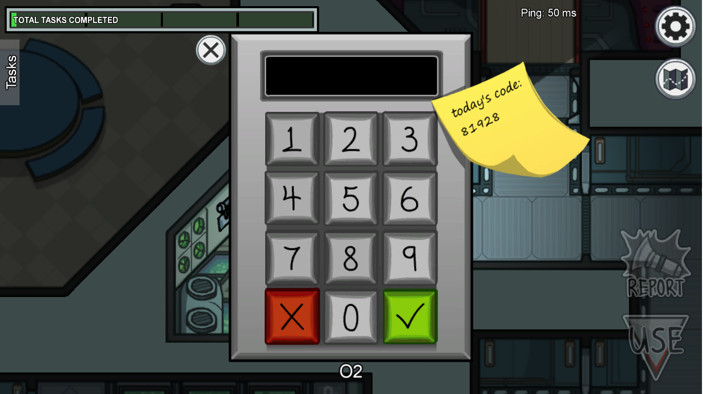
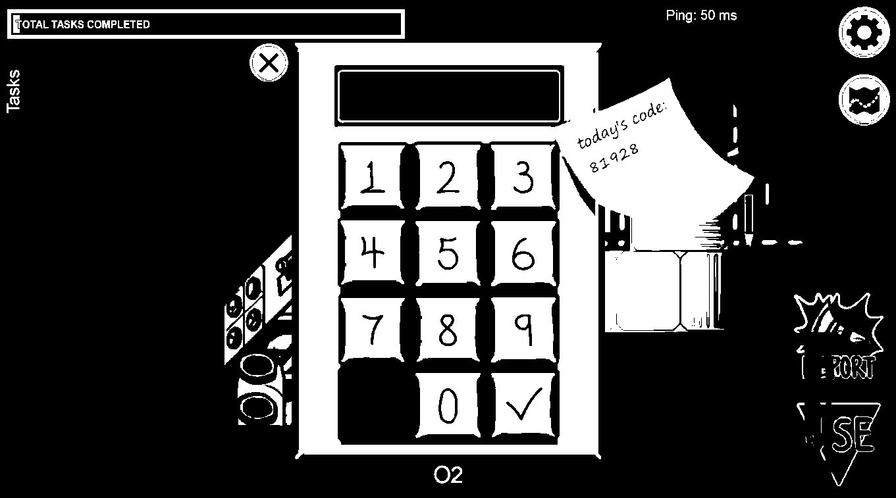
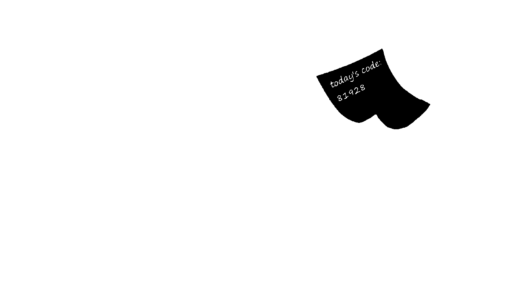
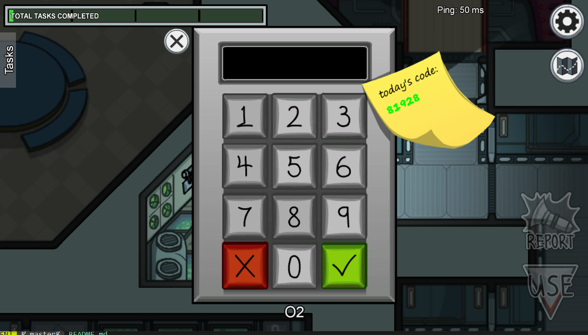

# AmongUs AI Solver
This is an attempt to automate some of the tasks that exists in AmongUs game using pyautogui and opencv.
Started with some simple tasks like fix wirings which was solved by hardcoding some coordinates on the screen.
Then used some basic computer vision techniques to solve other problems. One of the challenging one was O2 task.
The task requires figuring out what are the numbers on the sticky note and pressing that number on the keypad

